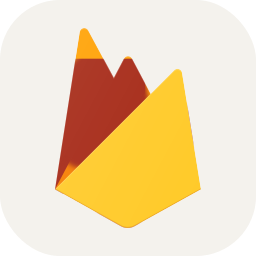
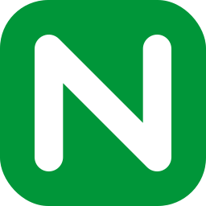

# WELCOME!

## About ME

With over a decade of experience in software development, I have honed my skills across a variety of industries. My passion lies in leveraging cutting-edge technologies to drive innovation and efficiency. I am particularly interested in the latest trends such as blockchain, AI integration, and serverless architecture.

## Technical Skills

I am proficient in a wide range of technologies and tools, including but not limited to:
  <table>
    <tr style="text-align: center;">
      <td style="padding: 10px;"> <b style="text-align: center;">Node.js</b></td>
      <td style="padding: 10px;"> <b style="text-align: center;">JavaScript</b></td>
      <td style="padding: 10px;"> <b style="text-align: center;">TypeScript</b></td>
      <td style="padding: 10px;"> <b style="text-align: center;">Python</b></td>
      <td style="padding: 10px;"> <b style="text-align: center;">.NET</b></td>
      <td style="padding: 10px;"> <b style="text-align: center;">GoLang</b></td>
    </tr>
    <tr style="text-align: center;">
      <td style="padding: 10px;"> <b style="text-align: center;">Solidity</b></td>
      <td style="padding: 10px;"> <b style="text-align: center;">Rust</b></td>
      <td style="padding: 10px;"> <b style="text-align: center;">React</b></td>
      <td style="padding: 10px;"> <b style="text-align: center;">Next.js</b></td>
      <td style="padding: 10px;"> <b style="text-align: center;">Vue.js</b></td>
      <td style="padding: 10px;"> <b style="text-align: center;">Django</b></td>
    </tr>
    <tr style="text-align: center;">
      <td style="padding: 10px;"> <b style="text-align: center;">Express.js</b></td>
      <td style="padding: 10px;"> <b style="text-align: center;">NestJS</b></td>
      <td style="padding: 10px;"> <b style="text-align: center;">PostgreSQL</b></td>
      <td style="padding: 10px;"> <b style="text-align: center;">MySQL</b></td>
      <td style="padding: 10px;"> <b style="text-align: center;">MongoDB</b></td>
      <td style="padding: 10px;"> <b style="text-align: center;">Firebase</b></td>
    </tr>
    <tr style="text-align: center;">
      <td style="padding: 10px;"> <b style="text-align: center;">Prisma</b></td>
      <td style="padding: 10px;"> <b style="text-align: center;">AWS</b></td>
      <td style="padding: 10px;"> <b style="text-align: center;">GCP</b></td>
      <td style="padding: 10px;"> <b style="text-align: center;">Ubuntu</b></td>
      <td style="padding: 10px;"> <b style="text-align: center;">Nginx</b></td>
      <td style="padding: 10px;"> <b style="text-align: center;">Docker</b></td>
    </tr>
  </table>

I am always eager to learn and adapt to new technologies, ensuring that I remain at the forefront of the ever-evolving tech landscape. Feel free to explore my repositories and connect with me for any collaboration opportunities.
